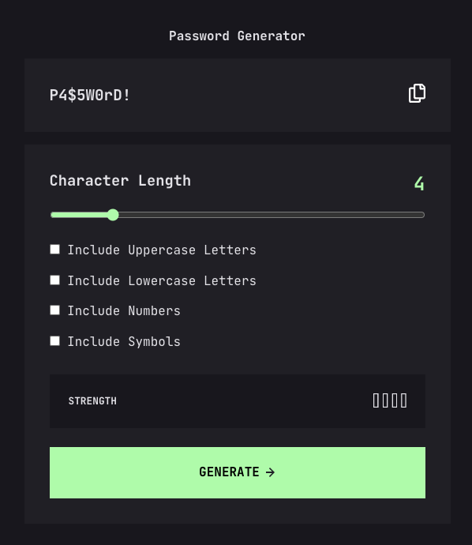

# Frontend Mentor - Password generator app solution

This is a solution to the [Password generator app challenge on Frontend Mentor](https://www.frontendmentor.io/challenges/password-generator-app-Mr8CLycqjh). Frontend Mentor challenges help you improve your coding skills by building realistic projects.

## Table of contents

- [Overview](#overview)
  - [The challenge](#the-challenge)
  - [Screenshot](#screenshot)
  - [Links](#links)
- [My process](#my-process)
  - [Built with](#built-with)
  - [What I learned](#what-i-learned)
  - [Helpful Links](#helpful-links)
- [Author](#author)

## Overview

### The challenge

Users should be able to:

- Generate a password based on the selected inclusion options
- Copy the generated password to the computer's clipboard
- See a strength rating for their generated password
- View the optimal layout for the interface depending on their device's screen size
- See hover and focus states for all interactive elements on the page

### Screenshot



### Links

- [Solution URL](https://github.com/codercreative/password-generator-app)
- [Live Site URL](https://password-generator-chris.netlify.app/)

## My process

Some of the various tasks/problems I had to work through when building the app:

**CSS**

- Change copy icon to green on hover
- Make range indicator green
- Create green checkboxes when user selects them
- Add transition effect on hover states

**Character Length**

- Implement dynamic character length adjustment using a range slider

**Generate Password**

- Ensure password generation logic to include various character type selections (uppercase, lowercase, numbers, symbols)

**Visually Represent Password Strength**

- Add strength indicators to visually represent the strength of the generated password

**Error Message**

- If no checkboxes are ticked - show an error message where the password is generated

**Copy to Clipboard**

- Add a copy-to-clipboard functionality

**Style the App Responsively**

**Accessibility**

- Ensure accessibility throughout the app

**Test for Various User Scenarios**

**Later Update**

- Add a reset button even though it is not part of the Figma design

### Built with

- Semantic HTML5 markup
- CSS custom properties
- Flexbox
- Mobile-first workflow

### What I learned

Adjust the number of characters dynamically based on user's range input.

```js
// SHOWING THE VALUE OF THE SLIDER RANGE
charRange.addEventListener("input", function () {
  charNumber.textContent = charRange.value;
});
```

In order to change the copy icon (svg) on hover, I placed the svg inline in the HTML:

```html
<svg class="copy-btn" width="21" height="24" xmlns="http://www.w3.org/2000/svg">
  <path
    d="M20.341 3.091 17.909.659A2.25 2.25 0 0 0 16.319 0H8.25A2.25 2.25 0 0 0 6 2.25V4.5H2.25A2.25 2.25 0 0 0 0 6.75v15A2.25 2.25 0 0 0 2.25 24h10.5A2.25 2.25 0 0 0 15 21.75V19.5h3.75A2.25 2.25 0 0 0 21 17.25V4.682a2.25 2.25 0 0 0-.659-1.591ZM12.469 21.75H2.53a.281.281 0 0 1-.281-.281V7.03a.281.281 0 0 1 .281-.281H6v10.5a2.25 2.25 0 0 0 2.25 2.25h4.5v1.969a.282.282 0 0 1-.281.281Zm6-4.5H8.53a.281.281 0 0 1-.281-.281V2.53a.281.281 0 0 1 .281-.281H13.5v4.125c0 .621.504 1.125 1.125 1.125h4.125v9.469a.282.282 0 0 1-.281.281Zm.281-12h-3v-3h.451c.075 0 .147.03.2.082L18.667 4.6a.283.283 0 0 1 .082.199v.451Z"
    fill="#FFF"
  />
</svg>
```

In order for the hover state to work, I had to remember to add path after the class name:

```css
.copy-icon {
  cursor: pointer;
}

.copy-icon path {
  transition: fill 0.3s ease;
}

.copy-icon:hover path {
  fill: #a4ffaf;
}
```

I exported the strength indicators (too weak, weak, medium and strong) from the Figma file into the assets folder. Easier than creating the strength bars myself.

I learned that you can use 0-9 or \d to check for digits in a string:

```js
[0-9]/.test(password)
/\d/.test(password)
```

Using accent-color to change the color of the range slider:

```css
.char-range {
  width: 100%;
  margin-bottom: 1em;
  accent-color: #a4ffaf;
}
```

In order to copy the password to the clipboard, I used the Clipboard API:

```js
function copyPassword() {
  const passwordText = generatedPassword.textContent;
  console.log(passwordText);

  if (passwordText === "P4$5W0rD!" || passwordText === "Tick at least 1 box") {
    return;
  }

  navigator.clipboard
    .writeText(passwordText)
    .then(() => {
      const originalText = generatedPassword.textContent;
      generatedPassword.textContent = "Copied!";
      generatedPassword.classList.add("copied");

      setTimeout(() => {
        generatedPassword.textContent = originalText;
        generatedPassword.classList.remove("copied");
      }, 2000);
    })
    .catch((err) => {
      console.log("Failed to copy: ", err);
    });
}
```

To determine the strength of the medium and strong password, I found this great solution: `&& hasUpperCase + hasLowerCase + hasNumbers + hasSymbols >= 2` and `&& hasUpperCase + hasLowerCase + hasNumbers + hasSymbols >= 3`

```js
const isTooWeak = length > 0 && length <= 4;
const isWeak = length > 4 && length <= 8;
const isMedium =
  length > 8 &&
  length < 14 &&
  hasUpperCase + hasLowerCase + hasNumbers + hasSymbols >= 2;

const isStrong =
  length >= 14 && hasUpperCase + hasLowerCase + hasNumbers + hasSymbols >= 3;
```

The checkmark boxes was a valuable learning experience:

```css
/* CHECKBOX HANDLING  */
.checkbox-wrapper {
  display: flex;
  flex-direction: column;
  gap: 10px;
}

[type="checkbox"] {
  opacity: 0;
  width: 0;
  height: 0;
  position: absolute;
}

[type="checkbox"] + label {
  position: relative;
  cursor: pointer;
  padding-left: 30px;
  /* labels are by default inline elements */
  display: inline-block;
  color: var(--almost-white);
  line-height: 25px;
}

/* the box around the checkmark  */
[type="checkbox"] + label::before {
  content: " ";
  position: absolute;
  width: 14px;
  height: 14px;
  border: 1px solid var(--almost-white);
  top: 50%;
  left: 2px;
  background-color: transparent;
  transform: translateY(-50%);
  transition: all 0.1s ease;
}

[type="checkbox"] + label:hover::before {
  border: 2px solid var(--green);
  background-color: rgba(163, 255, 174, 0.1);
}

/* the checkmark itself  */
[type="checkbox"]:checked + label::after {
  content: "";
  position: absolute;
  left: 2px;
  top: 50%;
  transform: translateY(-50%);
  background-image: url("assets/images/icon-check.svg");
  background-size: cover;
  height: 14px;
  width: 14px;
  background-color: var(--green);
  border: 2px solid var(--green);
}
```

Creating eventlisteners for the checkbox to ensure that the functionality of the app still works, if the user plays around with the range and the checkboxes:

```js
generatePassword);

lowercaseCheckbox.addEventListener("change", generatePassword);

numbersCheckbox.addEventListener("change", generatePassword);

symbolsCheckbox.addEventListener("change", generatePassword);

charRange.addEventListener("input", generatePassword);
```

## Helpful Links

[Custom Checkbox Pure CSS Tutorial - Andrew Wilson - YouTube](https://www.youtube.com/watch?v=NfW_5Y1RZQ4)

## Author

- [Frontend Mentor](https://www.frontendmentor.io/profile/codercreative)
